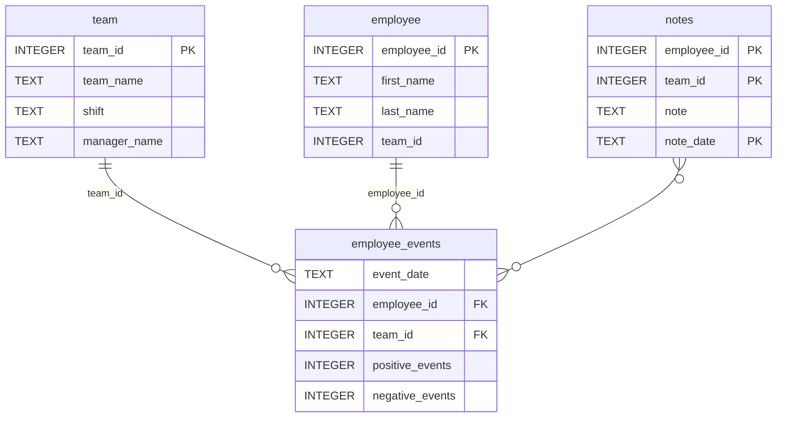

# Software Engineering for Data Scientists 

This repository contains code for the **Software Engineering for Data Scientists** final project, part of Udacity's Data Scientist nanodegree. 

### Author:
Benjamin Mardin

### Topic:
Data Science Dashboard

### Repository Structure
```
├── README.md
├── assets
│   ├── model.pkl
│   └── report.css
├── env
├── python-package
│   ├── employee_events
│   │   ├── __init__.py
│   │   ├── employee.py
│   │   ├── employee_events.db
│   │   ├── query_base.py
│   │   ├── sql_execution.py
│   │   └── team.py
│   ├── requirements.txt
│   ├── setup.py
├── report
│   ├── base_components
│   │   ├── __init__.py
│   │   ├── base_component.py
│   │   ├── data_table.py
│   │   ├── dropdown.py
│   │   ├── matplotlib_viz.py
│   │   └── radio.py
│   ├── combined_components
│   │   ├── __init__.py
│   │   ├── combined_component.py
│   │   └── form_group.py
│   ├── dashboard.py
│   └── utils.py
├── requirements.txt
├── start
├── tests
    └── test_employee_events.py
```

### employee_events.db



### Libraries used:
- pandas==2.3.1
- python-fasthtml=0.12.21

### Acknowledgements:
- Udacity data scientist program | Software Engineering for Data Scientists
- data sourced from Udacity 

#

